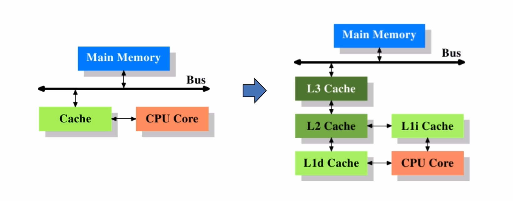
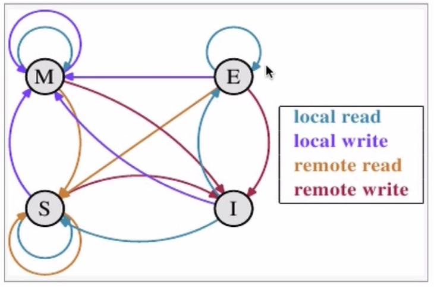
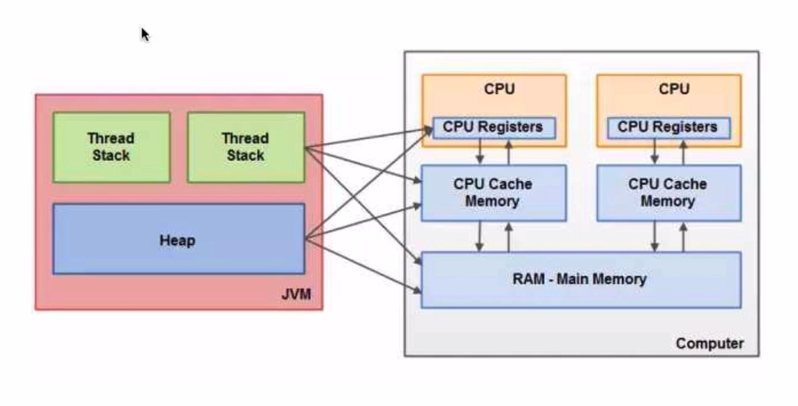
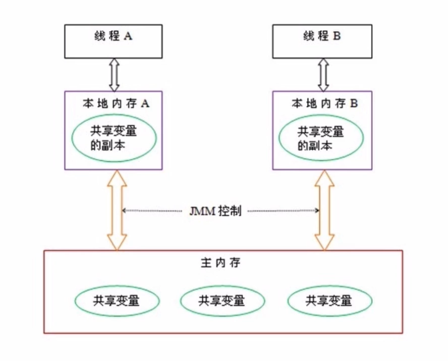
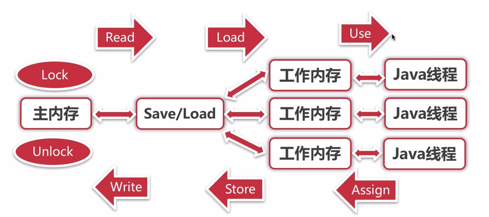
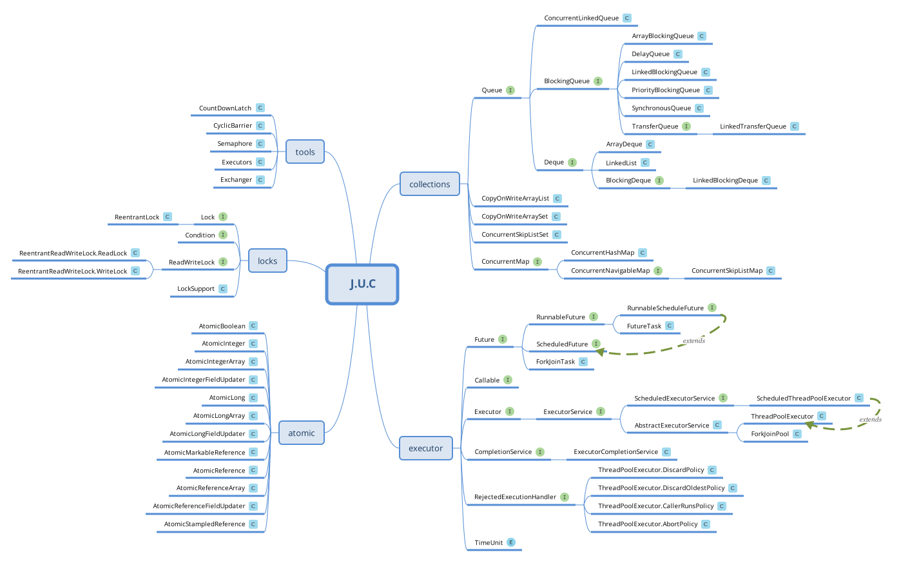
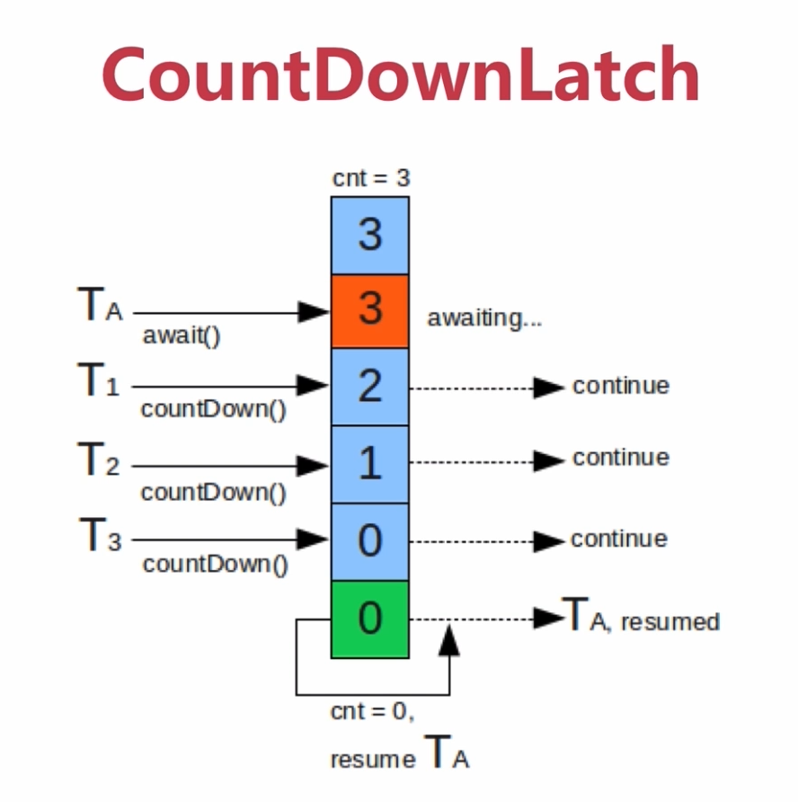
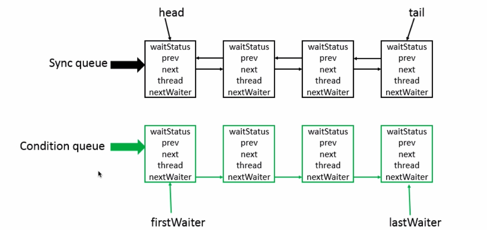

## 探索J.U.C之AQS的秘密

### 一、章节

- 了然于心 --- 并发基础
- 走马观花 --- J.U.C
- **小试牛刀 --- 同步组件**
- **寻根究底 --- AQS原理**
- 庖丁解牛 --- 应用场景

#### 二、了然于心 -- 并发基础

1. CPU多级缓存

	

	- 为什么需要CPU cache
		- CPU的频率太快，快到主存跟不上，这样在处理器时钟周期内，CPU常常是在等待主存，浪费资源。所以cache的出现，是为了缓解CPU和内存之间速度的不匹配问题（cpu -> cache -> memory）

	- CPU cache 存在的理论依据
		- 时间局部性

			> 如果某个数据被访问，那么在不久的将来它很可能被再次访问。

		- 空间局部性

			> 如果某个数据被访问，那么与它相邻的数据很快也可能被访问

	- 缓存一致性（MESI）

		</img>

		- 意义

			> 用于保证多个CPU cache之间缓存共享数据的一致性

		- MESI含义

			> Modified : 已修改缓存段

			> Exclusive : 独占缓存段

			> Shared : 共享缓存段

			> Invalid : 失效缓存段

	- 乱序执行优化

		- 代码顺序 : a = 10; b = 20; result = a + b;
		- 编译顺序 : b = 20; a = 10; result = a + b;

2. Java内存模型

	- JVM对应计算机结构

	</img>

	- JMM抽象结构图

	</img>

	- JMM同步操作与规则

		</img>

		- lock(锁定)

			> 作用于主内存的变量，把一个变量标识为一个线程独占状态

		- unlock(解锁)

			> 作用于主内存的变量，把一个处于锁定状态的变量释放出来，释放后的变量才可以被其他线程锁定

		- read(读取)

			> 作用于主内存的变量，把一个变量值从主内存传输到线程的工作内存中，以便随后的load动作使用

		- load(载入)

			> 作用于工作内存的变量，它把read操作从主内存中得到的变量值放入工作内存的变量副本中

		- use(使用)

			> 作用于工作内存的变量，把工作内存中的一个变量值传递给执行引擎

		- assign(赋值)

			> 作用于工作内存的变量，它把一个从执行引擎接收到的值赋值给工作内存的变量

		- store(存储)

			> 作用于工作内存的变量，把工作内存中的一个变量的值传送到主内存中，以便随后的write的操作

		- write(写入)

			> 作用于主内存的变量，它把store操作从工作内存中一个变量的值传送到主内存变量中

#### 三、走马观花 -- J.U.C

- J.U.C众类一览
		
	</img>

#### 四、小试牛刀 -- 同步组件

> Talk is cheap, Show me the code

- Semaphore

</img>

- CountDownLatch

</img>

- CyclicBarrier

</img>

- ReentrantLock

#### 五、寻根究底 -- AQS原理

> Talk is cheap, Show me the code

1. 《The java.util.concurrent Synchronizer Framework》重点解读

	</img>

2. AbstractQueuedSynchronizer 源码解读

	- 公平锁 VS 非公平锁
	- 独占锁 VS 共享锁
	- ReentrantLock VS synchronized
		- 可重入性
		- 锁的实现
		- 性能区别
		- 功能区别
		- ReentrantLock的特点
			- 可指定是公平锁还是非公平锁
			- 提供了一个Condition类，可以分组唤醒需要唤醒的线程
			- 提供能够中断等待锁的线程的机制，lock.lockInterruptibly()

#### 六、庖丁解牛 -- 应用场景

- Semaphore

	> Semaphore可以用于做流量控制，特别公用资源有限的应用场景，比如数据库连接。假如有一个需求，要读取几万个文件的数据，因为都是IO密集型任务，我们可以启动几十个线程并发的读取，但是如果读到内存后，还需要存储到数据库中，而数据库的连接数只有10个，这时我们必须控制只有十个线程同时获取数据库连接保存数据，否则会报错无法获取数据库连接。这个时候，我们就可以使用Semaphore来做流控

- CountDownLatch

	> 并行计算，当某个任务需要处理运算量非常大，可以将该运算任务拆分为多个子任务，等待所有的子任务完成之后，父任务再拿到所有子任务的运算结果进行汇总。利用CountDownLatch可以保证任务都被处理完才去执行最终的结果运算，过程中每一个线程都可以看做是一个子任务

- CyclicBarrier

	> 与 CountDownLatch类似

- ReentrantLock

	> 参见 ReentrantLock VS synchronized